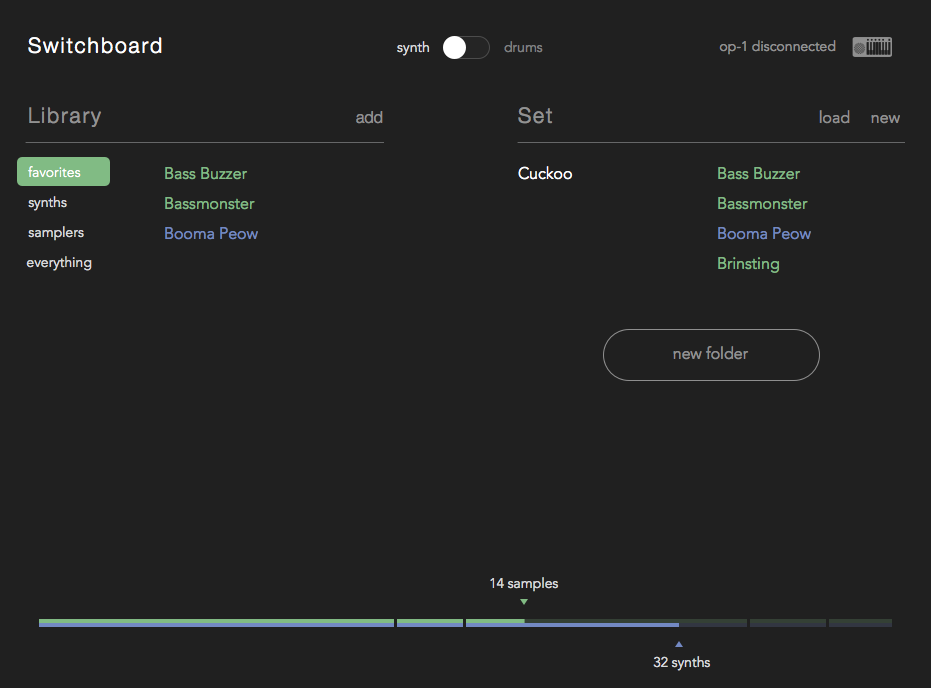

switchboard
========

sample management and publishing software for the Teenage Engineering OP-1.

the op-1 holds 26 synth samples and 100 synth models. swapping them in and out involves a lot of dragging things to and from external drives.

switchboard lets you create "sets" of samples and synth presets that you can flash to the op-1 by clicking a single button.

there are ambitions to make the process of pulling tracks and publishing to soundcloud easier, as well as consolidating some of the synth patches and models floating around the operator-1 forums. we'll see how far we get.

0.1 - basics and sets
===
- [x] scaffold with gulp, famo.us, and atom-shell
- [x] build a synth "set"
- [ ] load local samples
- [ ] detect op-1 connection
- [ ] upload "sets" to the OP-1
- [ ] build a drum "set"

0.11
===
- [ ] drag and drop to add files
- [ ] save and load sets
- [ ] preview local samples
- [ ] prompt to rename and save new snapshots

0.2 - sample discovery
===
- [ ] consolidate samples from operator-1 forums and old forums to switchboard.io (or available)
- [ ] find samples directly through switchboard
- [ ] publish saved presets to switchboard

0.3 - publishing
===
- [ ] save and restore tape tracks
- [ ] trim whitespace
- [ ] link account and upload to soundcloud

notes
===

passable progress bars currently require a patch to the famo.us GridLayout to [remove the rounding here](https://github.com/Famous/famous/blob/master/src/views/GridLayout.js#L57)